## 🌱 SK네트웍스 Family AI  캠프 19기 1차 프로젝트

### **1️⃣ 팀 소개**

- 팀명: 🍫 윌리6🚗
- 팀원 & GitHub

    | 이름  | 한줄소개             | GitHub                                  |
    | --- | --------------- | --------------------------------------- |
    |이인재|¿?| [🔗 GitHub](https://github.com/eco) |
    | 이승원(디바)  | 노력해볼게요 | [🔗 GitHub](https://github.com/seungwon-sw)    |
    | 김소희(윈스턴) | 나무보다 숲을 보는 분석하는 개발자 🤣      | [🔗 GitHub](https://github.com/sosodoit) |
    | 신지섭(솔저)  | 항상 피곤한 개발자😪 | [🔗 GitHub](https://github.com/Melonmacaron) |

### **2️⃣ 프로젝트 개요**

- 프로젝트 명

    👉 친환경차 혜택 정보 통합 플랫폼

- 프로젝트 소개
    
    친환경 차량에 관한 등록 데이터, 국가 보조금, 카드사 혜택 등을 한 곳에서 볼 수 있는 웹사이트를 제공합니다.

    이를 통해 소비자가 데이터 기반의 정보와 구매 시 및 구매 이후 혜택을 쉽게 확인할 수 있도록 돕습니다.
    
- 프로젝트 필요성(배경)
    
    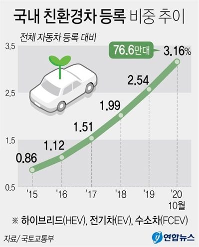
    
    - 최근 친환경차 등록 수 증가

    정부·지자체의 다양한 보조금 정책

    실 데이터로 확인 
    
    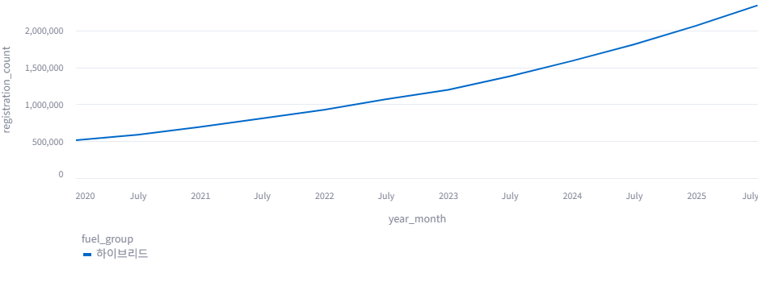
    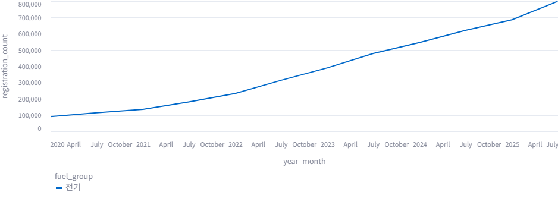
    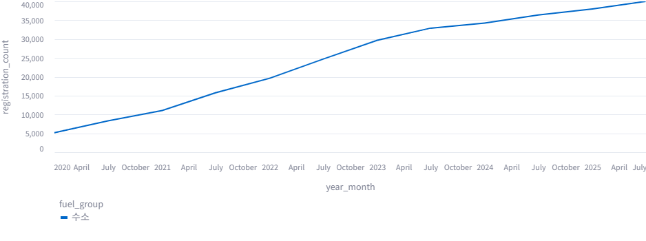
    
    - 친환경 차량 비중 증가 > 관련 혜택 수요 증가 (예상)

    *혜택을 크게 관심가질 보조금과 카드를 선정*

    *특히, 혜택을 꼼꼼히 따지는 소비자*
    
    → 위 정보를 근거하여, 소비자의 정보 탐색 비용을 줄이고 구매를 촉진할 필요성이 존재
    
- 프로젝트 목표

    친환경차 구매 잠재 고객의 정보 접근성 향상을 목표로, 데이터·시각화·혜택 정보 통합을 통해 소비자 중심의 서비스를 제공하는 것을 목표로 합니다.

    주요 목표 기능

        📊 친환경차 중심의 연료별 차량 등록 현황 시각화

        💳 국가/지자체 보조금 및 신용카드 혜택 정보 안내

        ❓ 친환경차 FAQ 제공

- 📂 프로젝트 구조
    ```
    project/
    │── data_collection/   # 데이터 수집/적재 코드
    │── mysql/             # DB 관련 코드 및 쿼리
    │── streamlit/         # 화면 구현 코드
    │── etc/               # WBS, 요구사항 문서 등
    ```

- 활용 데이터
    - 웹 크롤링 기반 수집 데이터
    - 정부/지자체 공개 데이터 (친환경차 등록현황, 보조금 정책)
    - 카드사 홈페이지 (카드별 혜택)

### **3️⃣ 기술 스택**

- 협업: Notion, Git, GitHub
- 데이터: MySQL, 크롤링(Selenium + BeautifulSoup), 데이터 정제/처리(Pandas)
- 언어 & 환경: Python, VSCode
- 프론트엔드: Streamlit

### **4️⃣ WBS**

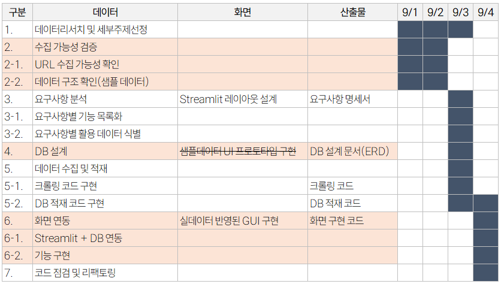

### **5️⃣ ERD** 
    
   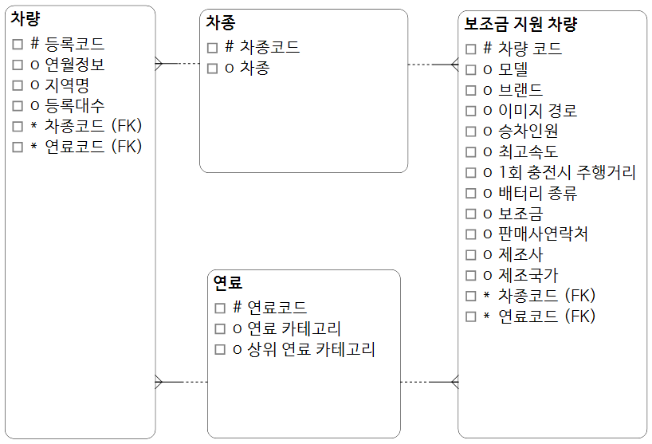

   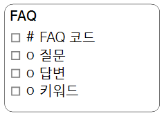
    
   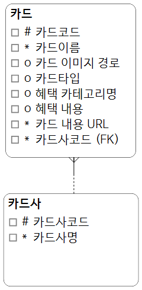
 
   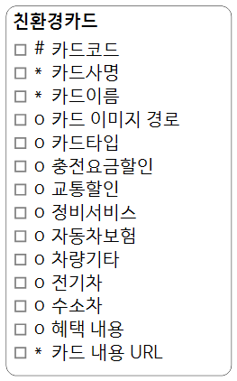

### **6️⃣ 요구사항 명세서**

- 시간되면 표로 작성 

   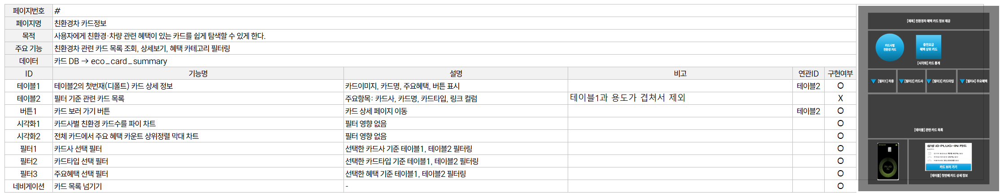
   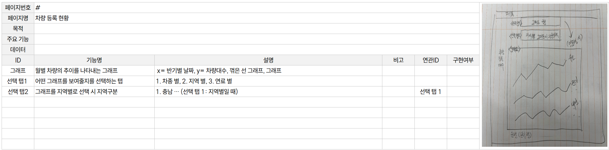
   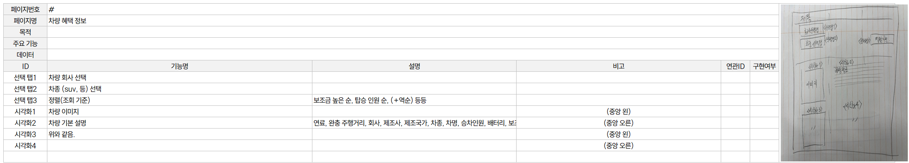
   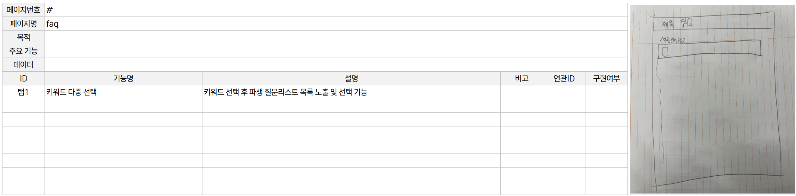

### **7️⃣ 수행결과(테스트/시연 페이지)**

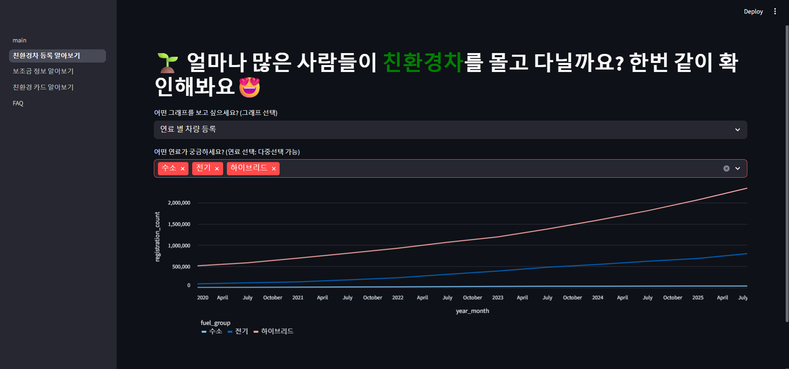
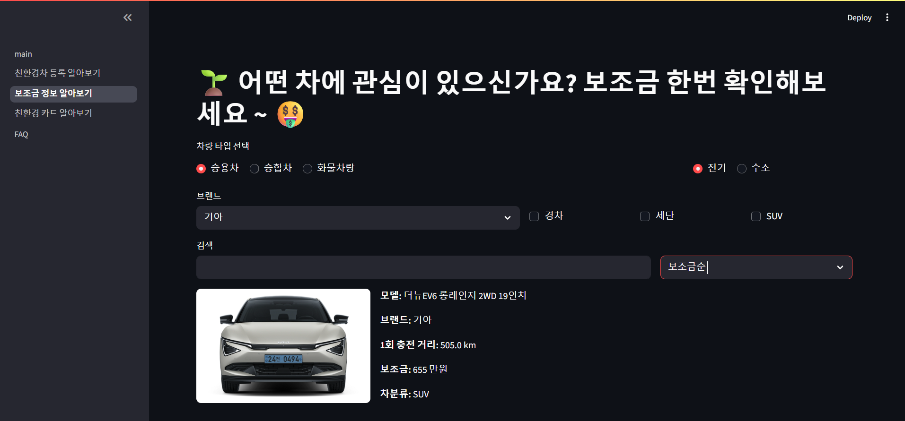
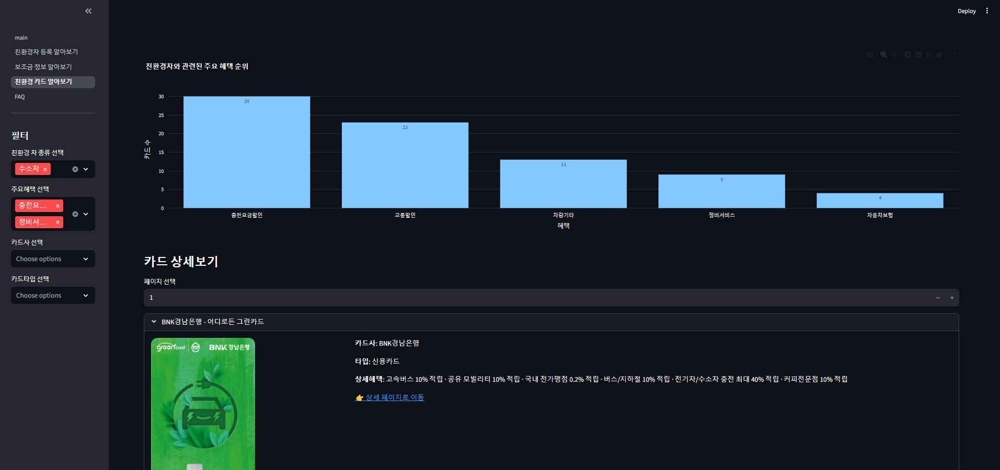
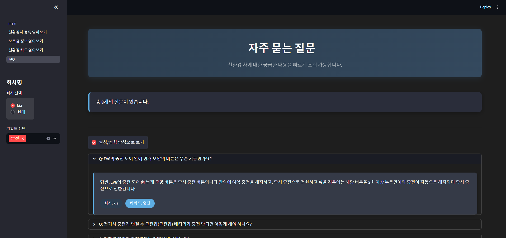

### **8️⃣ 한 줄 회고**

- 한줄회고

    | 이름  | 한줄회고             |
    | --- | --------------- |
    | 이인재 | 팀프로젝트를 처음 해서도 있겠지만 시간이 부족하다고 느꼈다. 이전 수업을 적용하는 프로젝트이지만, 배운것들을 두루 응용하여 진행 해야 하기 때문에 하면서 실력에 대한 부족함을 느꼈고, 앞으로 배운 것을 어떻게 응용 해봐야 할지 알게 된 좋은 경험이 되었다고 생각되었다.
    | 이승원  | 팀프로젝트를 하며 실력의 부족함이 절실히 드러난 것 같다. 팀프로젝트에서 실력이 낮은 사람이 될 경우, 그래도 가능한 부분을 주도적으로 찾아보는 것이 필요하다는 생각이 들었다. 그리고 협업을 위해서 미리 역량을 길러야겠다는 생각이 들었다. 언제든 배우지 않은 부분을 구현해야 하는 상황도 발생할 수 있을 것 같은데, 이때 팀원의 협조를 받거나 정보를 수집하는 것이 중요하다는 것을 알게 되었다.  | 
    | 김소회 |       | 
    | 신지섭 | 2일이라는 시간이 정신없을 만큼 빠르게 지나갔지만 프로젝트를 진행하면서 MySQL구문에 익숙해졌고 DB구조를 구축하는 능력이 향상된 것 같습니다. Selenium을 이용한 동적인 웹 페이지 크롤링 과정을 통해 웹 페이지의 구조를 이해하는데에 익숙해지는 경험이 된 것 같습니다. 모든 팀원분들 모두 너무 고생많으셨습니다!!! | 

🔎 아쉬운점&개선점
    
- 섬세하게 다루지 못한 데이터가 있어 아쉬움 (차량 모델·카드 혜택 카테고리 세분화 필요)

- 기한 내 작업계획·범위가 명확하지 못했던 점 → 프로젝트 관리 개선 필요

- 향후 더 많은 외부 API 연동 고려 필요

- 등등등

⚡이슈 해결 과정

1. 셀레니움 차단 문제

    검색 입력 후 페이지 차단 → HTML 저장 후 BeautifulSoup으로 스크래핑하여 해결

2. 차량 이미지 수집 문제

이미지 접근 차단 → Selenium 캡처 기능으로 저장하여 해결

3. … 추가 이슈 정리 예정