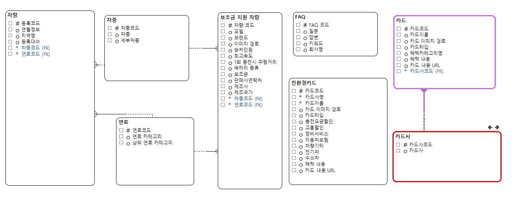
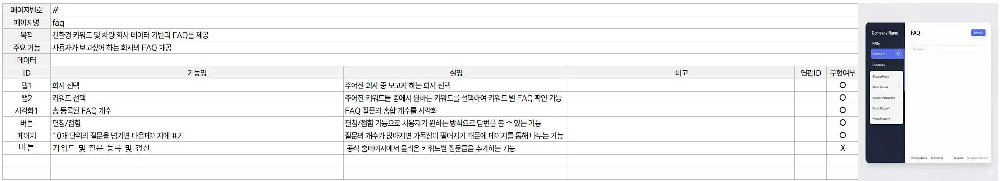
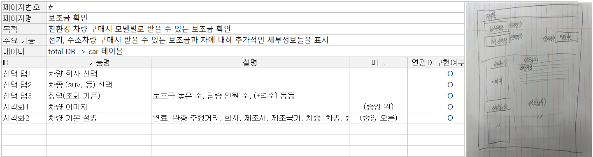
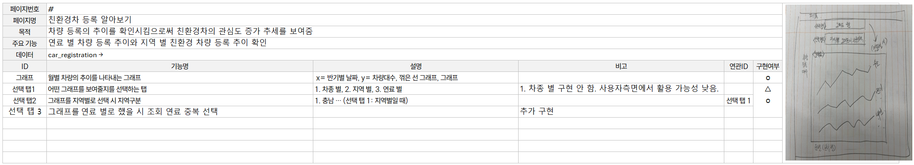

## 🌱 SK네트웍스 Family AI  캠프 19기 1차 프로젝트

### **1️⃣ 팀 소개**

- 팀명: 🍫 윌리6 🚗
- 팀원 & GitHub

    | 이름  | 한줄소개             | GitHub                                  |
    | --- | --------------- | --------------------------------------- |
    | 이인재 | 열심히하겠습니다 | [🔗 GitHub](https://github.com/distecter) |
    | 이승원 | 노력해볼게요 | [🔗 GitHub](https://github.com/seungwon-sw)    |
    | 김소희 | 나무보다 숲을 보는 분석하는 개발자 🤣      | [🔗 GitHub](https://github.com/sosodoit) |
    | 신지섭 | 항상 피곤한 개발자😪 | [🔗 GitHub](https://github.com/Melonmacaron) |

### **2️⃣ 프로젝트 개요**

#### 프로젝트 명

    👉 친환경차 혜택 정보 통합 플랫폼

#### 프로젝트 소개

    친환경 차량에 관한 등록 데이터, 국가 보조금, 카드사 혜택 등을 
    한 곳에서 볼 수 있는 웹사이트를 제공합니다.

    이를 통해 소비자가 데이터 기반의 정보와 구매 시 및 
    구매 이후 혜택을 쉽게 확인할 수 있도록 돕습니다.
    

#### 프로젝트 필요성(배경)
    


- 최근 친환경차 등록 수 증가 & 정부·지자체의 다양한 보조금 정책
    


- 친환경 차량 비중 증가 > 관련 혜택 수요 증가 (예상)   
→ 위 정보를 근거하여, 소비자의 정보 탐색 비용을 줄이고 구매를 촉진할 필요성이 존재
    
#### 프로젝트 목표

    친환경차 구매 잠재 고객의 정보 접근성 향상을 목표로, 데이터·시각화·혜택 정보 통합을 통해
    소비자 중심의 서비스를 제공하는 것을 목표로 합니다!

#### 주요 목표 기능

    📊 친환경차 중심의 연료별 차량 등록 현황 시각화

    💳 국가/지자체 보조금 및 신용카드 혜택 정보 안내

    ❓ 친환경차 FAQ 제공

#### 📂 프로젝트 구조
```
project/
│── data_collection/   # 데이터 수집/적재 코드
│── mysql/             # DB 관련 코드 및 쿼리
│── streamlit/         # 화면 구현 코드
│── etc/               # WBS, 요구사항 문서 등
```

#### 활용 데이터
- [친환경 자동차 등록 현황](https://stat.molit.go.kr/portal/cate/statMetaView.do?hRsId=58&hFormId=1244&hSelectId=1244&hPoint=00&hAppr=1&hDivEng=&oFileName=&rFileName=&midpath=&sFormId=1244&sStart=2024&sEnd=2024&sStyleNum=562&settingRadio=xlsx)
- [국가 보조금](https://ev.or.kr/nportal/monitor/evMap.do#)
- [카드 고릴라](https://www.card-gorilla.com/search/all?keyword=%EC%A0%84%EA%B8%B0%EC%B0%A8)
- [현대FAQ](https://www.hyundai.com/kr/ko/faq.html)
- [기아FAQ](https://www.kia.com/kr/customer-service/center/faq)

### **3️⃣ 기술 스택**

- 협업: Notion, Git, GitHub
- 데이터: MySQL, 크롤링(Selenium + BeautifulSoup), 데이터 정제/처리(Pandas)
- 언어 & 환경: Python, VSCode
- 프론트엔드: Streamlit

### **4️⃣ WBS**


### **5️⃣ ERD** 
    
   

### **6️⃣ 요구사항 명세서**

   
   
   
   

### **7️⃣ 수행결과(테스트/시연 페이지)**

1. 페이지명: 친환경차 등록 현황 알아보기
    - 목적: 차량 등록의 추이를 확인시킴으로서 친환경차의 관심도 증가 추세를 보여줌


2. 페이지명: 보조금 확인
    - 목적: 친환경 차량 구매시 모델별로 받을 수 있는 보조금 확인


3. 페이지명: 친환경차 카드정보 
    - 목적: 사용자에게 친환경 차량 관련 혜택이 있는 카드 정보 제공


4. 페이지명:FAQ
    - 목적: 차량 회사 데이터 기반의 FAQ를 친환경 차량 키워드로 제공


---

### **⚡이슈 해결 과정**

1. 셀레니움 차단 문제

    검색 입력 후 페이지 차단 → HTML 저장 후 BeautifulSoup으로 스크래핑하여 해결

2. 문제상황 : 보조금 차량 데이터 수집과정에서 사이트에 있는 이미지 소스 링크가 직접적인 접근을 차단한 상태

    해결과정 : Selenium 브라우저의 스크린샷 메서드로 해결하려고 했지만 화면의 위쪽 레이어에 존재하는 여러 요소들이 사진을 가려졌지만 해당 요소를 비활성화 시키는 JS코드를 이용하여 해당요소를 화면에서 비활성화시킨후 Selenium 브라우저의 스크린샷 메서드를 이용하여 문제 해결
    
    결과 : 해당 사이트에 존재하는 모든 보조금 차량 이미지 크롤링 완료

### **🔎 아쉬운점 & 개선점**

- 섬세하게 다루지 못한 데이터가 있어 아쉬움 (차량 모델·카드 혜택 카테고리 세분화 필요)

- 기한 내 작업계획·범위가 명확하지 못했던 점 → 프로젝트 관리 개선 필요

- 향후 더 많은 외부 API 연동 고려 필요


### **한 줄 회고**

| 이름  | 한줄회고          |
| ------ | --------------- |
| 이&nbsp;인&nbsp;재 | 개인의 사정상 streamlit, web crawling의 수업을 듣지 못했지만 팀원들의 도움으로 동적, 정적 크롤링 코드의 작성법 및 반복문의 응용을 제대로 하며 기본 문법의 중요성을 다시금 깨닫게 되었고 db생성, 연결, 등록을 크롤링을 이용해 직접 하게되어 데이터가 어떻게 등록되어 구분하는지 명확하게 알게되어 의미가 있던 프로젝트였다. |
| 이&nbsp;승&nbsp;원 | 파일 정제 및 파이썬을 통한 DB 적재, DB를 활용한 streamlit 구현을 해볼 수 있었다.  | 
| 김&nbsp;소&nbsp;희 | 상황에 맞게 도구를 효율적으로 활용함으로써 문제를 해결해갔던 점이 인상깊었습니다. 너무 정리되지 않은 로데이터도 바로 적재하기 보다는 엑셀을 통해 데이터를 정제하고, 크롤링이 차단되면 대안으로 html을 저장하여 파싱하는 과정으로 해결하는 등 이런 과정을 팀원과 함께 헤쳐나가서 더욱 흥미롭게 프로젝트에 참여할 수 있었습니다. | 
| 신&nbsp;지&nbsp;섭 | 보조금확인 페이지 구현을 중점적으로 담당하였습니다. 동적인 웹 페이지의 데이터를 크롤링해야했기에 Selenium브라우저를 이용하여 크롤링을 진행하였고 공통된 컬럼을 갖는 등록데이터와의 정규화를 진행하였습니다. |
